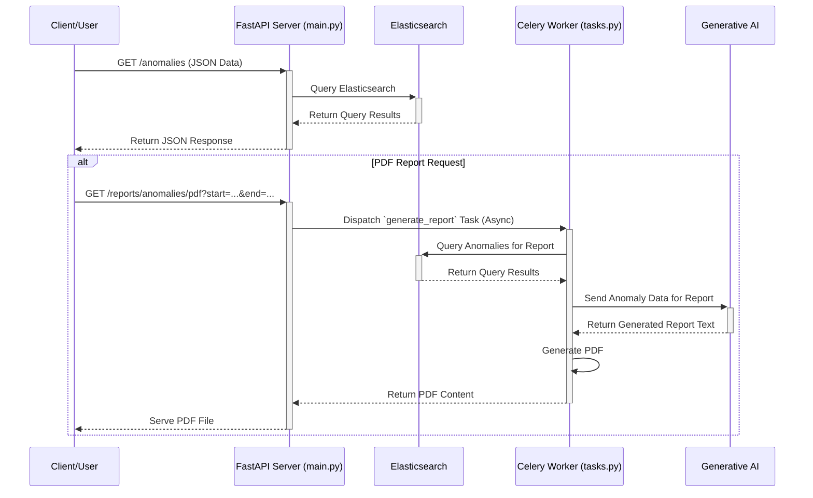

```mermaid
sequenceDiagram
    participant User as Client/User
    participant API as FastAPI Server (main.py)
    participant ES as Elasticsearch
    participant CW as Celery Worker (tasks.py)
    participant AI as Generative AI
    
    User->>+API: GET /anomalies (JSON Data)
    API->>+ES: Query Elasticsearch
    ES-->>-API: Return Query Results
    API-->>-User: Return JSON Response

    alt PDF Report Request
        User->>+API: GET /reports/anomalies/pdf?start=...&end=...
        API->>+CW: Dispatch `generate_report` Task (Async)
        CW->>+ES: Query Anomalies for Report
        ES-->>-CW: Return Query Results
        CW->>+AI: Send Anomaly Data for Report
        AI-->>-CW: Return Generated Report Text
        CW->>CW: Generate PDF
        CW-->>-API: Return PDF Content
        API-->>-User: Serve PDF File
    end
```