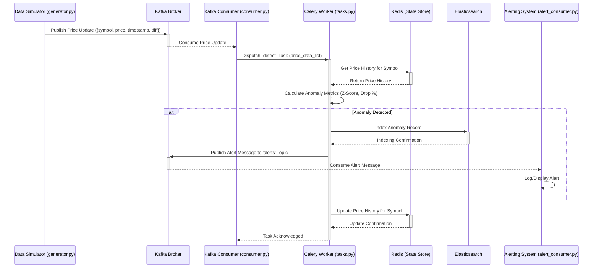

```mermaid
sequenceDiagram
    participant DS as Data Simulator (generator.py)
    participant K as Kafka Broker
    participant C as Kafka Consumer (consumer.py)
    participant CW as Celery Worker (tasks.py)
    participant R as Redis (State Store)
    participant ES as Elasticsearch
    participant AL as Alerting System (alert_consumer.py)

    DS->>+K: Publish Price Update ({symbol, price, timestamp, diff})
    K-->>-C: Consume Price Update
    C->>+CW: Dispatch `detect` Task (price_data_list)
    CW->>+R: Get Price History for Symbol
    R-->>-CW: Return Price History
    CW->>CW: Calculate Anomaly Metrics (Z-Score, Drop %)
    alt Anomaly Detected
        CW->>+ES: Index Anomaly Record
        ES-->>-CW: Indexing Confirmation
        CW->>+K: Publish Alert Message to 'alerts' Topic
        K-->>-AL: Consume Alert Message
        AL->>AL: Log/Display Alert
    end
    CW->>+R: Update Price History for Symbol
    R-->>-CW: Update Confirmation
    CW-->>-C: Task Acknowledged
```