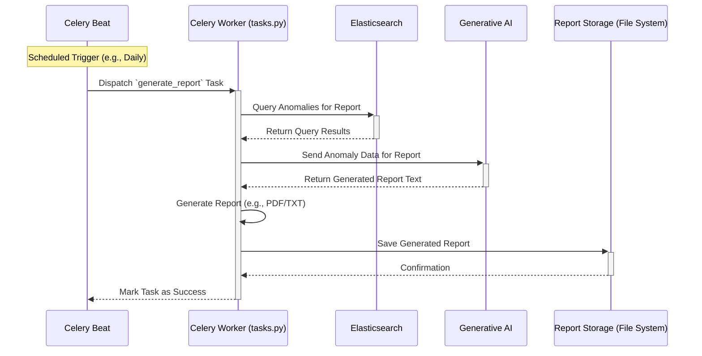

```mermaid
sequenceDiagram
    participant CB as Celery Beat
    participant CW as Celery Worker (tasks.py)
    participant ES as Elasticsearch
    participant AI as Generative AI
    participant ReportStore as Report Storage (File System)

    Note over CB: Scheduled Trigger (e.g., Daily)
    CB->>+CW: Dispatch `generate_report` Task
    CW->>+ES: Query Anomalies for Report
    ES-->>-CW: Return Query Results
    CW->>+AI: Send Anomaly Data for Report
    AI-->>-CW: Return Generated Report Text
    CW->>CW: Generate Report (e.g., PDF/TXT)
    CW->>+ReportStore: Save Generated Report
    ReportStore-->>-CW: Confirmation
    CW-->>-CB: Mark Task as Success


```