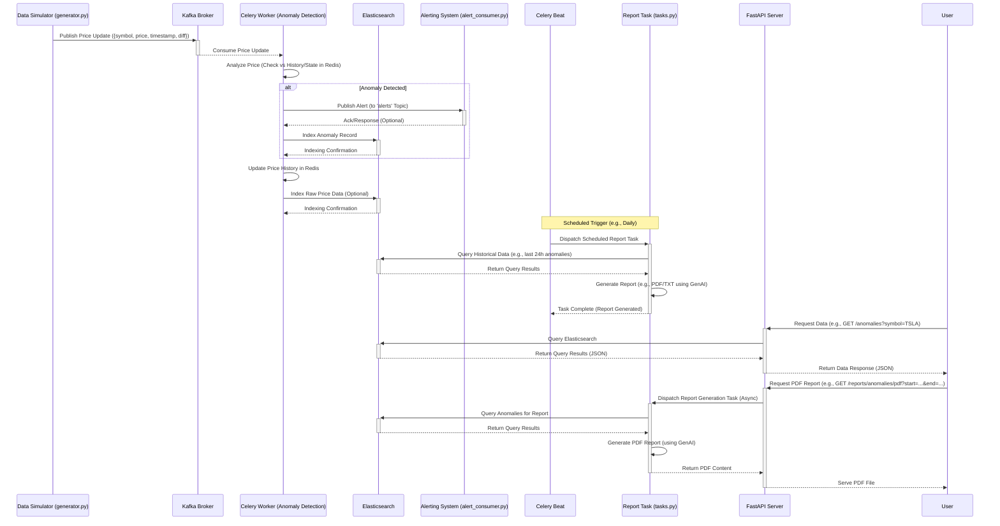

```mermaid
sequenceDiagram
    participant DS as Data Simulator (generator.py)
    participant K as Kafka Broker
    participant CW as Celery Worker (Anomaly Detection)
    participant ES as Elasticsearch
    participant AL as Alerting System (alert_consumer.py)
    participant CB as Celery Beat
    participant RT as Report Task (tasks.py)
    participant API as FastAPI Server
    participant User

    DS->>+K: Publish Price Update ({symbol, price, timestamp, diff})
    K-->>-CW: Consume Price Update
    CW->>CW: Analyze Price (Check vs History/State in Redis)
    alt Anomaly Detected
        CW->>+AL: Publish Alert (to 'alerts' Topic)
        AL-->>-CW: Ack/Response (Optional)
        CW->>+ES: Index Anomaly Record
        ES-->>-CW: Indexing Confirmation
    end
    CW->>CW: Update Price History in Redis
    CW->>+ES: Index Raw Price Data (Optional)
    ES-->>-CW: Indexing Confirmation

    Note over CB, RT: Scheduled Trigger (e.g., Daily)
    CB->>+RT: Dispatch Scheduled Report Task
    RT->>+ES: Query Historical Data (e.g., last 24h anomalies)
    ES-->>-RT: Return Query Results
    RT->>RT: Generate Report (e.g., PDF/TXT using GenAI)
    RT-->>-CB: Task Complete (Report Generated)

    User->>+API: Request Data (e.g., GET /anomalies?symbol=TSLA)
    API->>+ES: Query Elasticsearch
    ES-->>-API: Return Query Results (JSON)
    API-->>-User: Return Data Response (JSON)

    User->>+API: Request PDF Report (e.g., GET /reports/anomalies/pdf?start=...&end=...)
    API->>+RT: Dispatch Report Generation Task (Async)
    RT->>+ES: Query Anomalies for Report
    ES-->>-RT: Return Query Results
    RT->>RT: Generate PDF Report (using GenAI)
    RT-->>-API: Return PDF Content
    API-->>-User: Serve PDF File
```