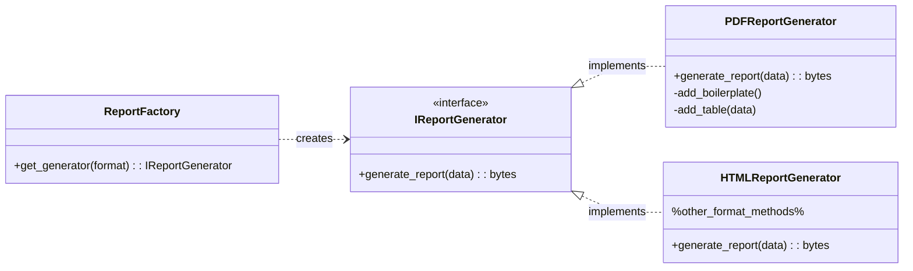

```mermaid
classDiagram
    direction LR

    class IReportGenerator {
        <<interface>>
        +generate_report(data): bytes
    }

    class PDFReportGenerator {
        +generate_report(data): bytes
        -add_boilerplate()
        -add_table(data)
    }

    class HTMLReportGenerator {
        +generate_report(data): bytes
        %other_format_methods%
    }

    class ReportFactory {
        +get_generator(format): IReportGenerator
    }

    IReportGenerator <|.. PDFReportGenerator : implements
    IReportGenerator <|.. HTMLReportGenerator : implements

    ReportFactory ..> IReportGenerator : creates

```