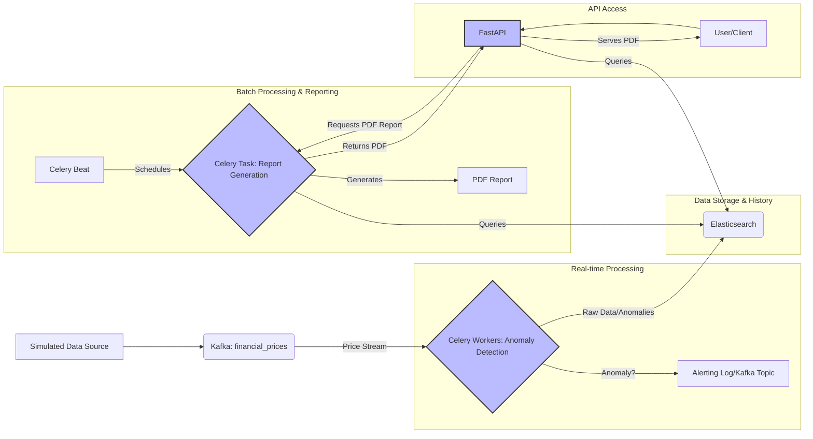

```mermaid
graph LR
    A[Simulated Data Source] --> B(Kafka: financial_prices);
    B -- Price Stream --> C{Celery Workers: Anomaly Detection};
    C -- Anomaly? --> D[Alerting Log/Kafka Topic];
    C -- Raw Data/Anomalies --> E(Elasticsearch);

    subgraph Real-time Processing
        C; D;
    end

    subgraph Data Storage & History
        E;
    end

    subgraph Batch Processing & Reporting
        CB[Celery Beat] -- Schedules --> CT{Celery Task: Report Generation};
        CT -- Queries --> E;
        CT -- Generates --> H[PDF Report];
        CB; CT; H;
    end

    subgraph API Access
        I[FastAPI] -- Queries --> E;
        J[User/Client] --> I;
        I -- Requests PDF Report --> CT;
        CT -- Returns PDF --> I;
        I -- Serves PDF --> J;
        I; J;
    end

    style C fill:#bbf,stroke:#333,stroke-width:2px
    style CT fill:#bbf,stroke:#333,stroke-width:2px
    style I fill:#bbf,stroke:#333,stroke-width:2px
```